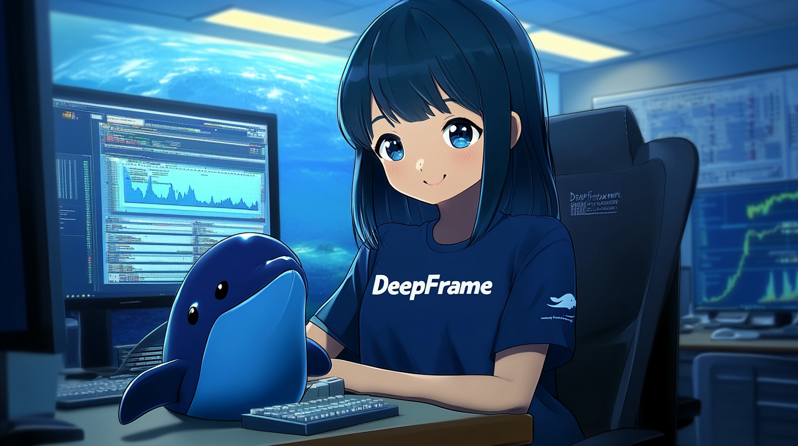

Got it! Let’s update the **README** with the new name **DeepFrame**. Here's the revised version:

---

# DeepFrame 🚀

<div align="center">
  
</div>

<div align="center">

📑 [Technical Report](#) |  📖 [Documentation](#) | 🎯 [Examples](#)

</div>

---

## 🚀 Quick Start: Initialize DeepFrame with Deepseek API

Here’s a quick example to initialize an agent using the **Deepseek API** in **TypeScript**:

```typescript
import { DeepFrameAgent } from 'deepframe';

// Initialize the agent with Deepseek API
const agent = new DeepFrameAgent({
  apiKey: process.env.DEEPSEEK_API_KEY, // Your Deepseek API key
  model: 'deepseek-chat',               // Default model
  apiUrl: 'https://api.deepseek.com',   // Deepseek API endpoint
});

// Start the agent
agent.start()
  .then(() => {
    console.log('DeepFrame agent is running!');
  })
  .catch((err: Error) => {
    console.error('Failed to start agent:', err.message);
  });
```

Make sure to set your `DEEPSEEK_API_KEY` in the `.env` file (see below).

---

## 🚩 Overview

**DeepFrame** is a powerful AI agent framework built on **Eliza**, enhanced with **Deepseek** integration for advanced conversational capabilities. It’s designed for building intelligent chatbots, autonomous agents, and document-based AI systems.

---

## ✨ Features

- **🤖 Deepseek Integration**: Advanced conversational intelligence.
- **🛠️ Multi-Platform Support**: Discord, Twitter, and Telegram connectors.
- **🔗 Model Agnostic**: Works with any model (Llama, Grok, OpenAI, etc.).
- **📚 Document Interaction**: Ingest and interact with documents.
- **💾 Retrievable Memory**: Persistent memory for long-term interactions.
- **🚀 Extensible Architecture**: Add custom actions and plugins.

---

## 🎯 Use Cases

- **🤖 Chatbots**: Customer support, entertainment, or personal use.
- **🕵️ Autonomous Agents**: Perform tasks autonomously.
- **📈 Business Automation**: Automate workflows and processes.
- **🎮 Video Game NPCs**: Lifelike NPCs with advanced conversations.
- **🧠 Trading**: AI-driven trading systems.

---

## 🛠️ Setup

### Prerequisites

- [Python 2.7+](https://www.python.org/downloads/)
- [Node.js 23+](https://nodejs.org/)
- [pnpm](https://pnpm.io/installation)

### Installation

1. Clone the repository:

   ```bash
   git clone https://github.com/your-repo/deepframe.git
   cd deepframe
   ```

2. Copy `.env.example` to `.env` and fill in your Deepseek API key:

   ```bash
   cp .env.example .env
   ```

3. Install dependencies and start the agent:

   ```bash
   pnpm install
   pnpm build
   pnpm start
   ```

---

## 📄 Example `.env` Configuration

```env
# Deepseek Configuration
DEEPSEEK_API_KEY=your-deepseek-api-key
DEEPSEEK_API_URL=https://api.deepseek.com
SMALL_DEEPSEEK_MODEL=deepseek-chat
MEDIUM_DEEPSEEK_MODEL=deepseek-chat
LARGE_DEEPSEEK_MODEL=deepseek-chat

# Server & DB Configurations
CACHE_STORE=database
SERVER_PORT=3000
VITE_SERVER_PORT=${SERVER_PORT}
```

---

## 🤝 Community & Support

- [GitHub Issues](https://github.com/your-repo/deepframe/issues): Report bugs or propose features.
- [Discord](https://discord.gg/deepframe): Join the community and share your projects.

---

## 📜 Citation

If you use DeepFrame in your research, please cite our work:

```bibtex
@article{your2025deepframe,
  title={DeepFrame: Advanced AI Agent Framework with Deepseek Integration},
  author={Your Name and Collaborators},
  journal={arXiv preprint arXiv:XXXX.XXXXX},
  year={2025}
}
```

---

## Contributors

<a href="https://github.com/your-repo/deepframe/graphs/contributors">
  
</a>

---

Let me know if you need further adjustments! 🚀
